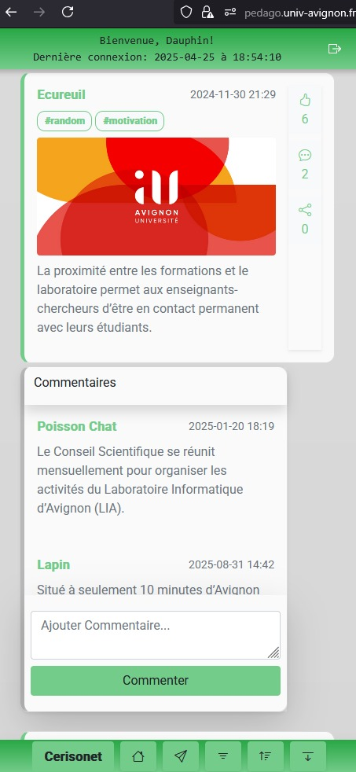
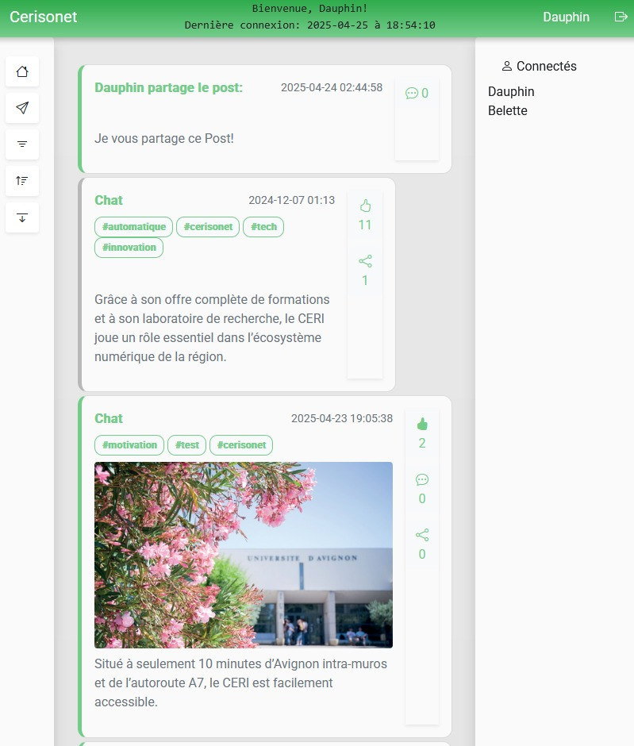
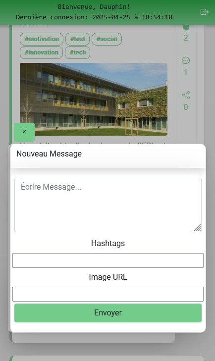
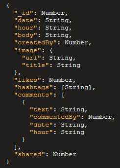

# 🌐 CERISoNet – Social Media Messaging

## 🎯 Purpose
CERISoNet is a full-stack social media web application developed as part of the AMS Web Application course. Its primary goal is to help students master the MEAN stack and related technologies through a real-world SPA (Single Page Application) project. The app enables users to interact with messages posted on a shared social network and view real-time user activity.

## 🏗️ System Architecture

The application is composed of the following components:

- **Frontend (Angular + Bootstrap)**:
  - SPA architecture for responsive, device-agnostic access
  - WebSocket-based communication with the backend
  - Responsive UI styled using Bootstrap
  - Extra interface to test the API service

- **Backend (Node.js + Express)**:
  - Handles WebSocket connections and user session management
  - Communicates to databases
  
- **Databases**
  - Postgre SQl - used to authenticate users
  - MongoDB - used to stores all users' messages

- **Quarkus API Service**:
  - Performs CRUD operations in the `db-CERI` MongoDB database

---

## 📦 Functional Specifications

- Log in with email and password

- View last login timestamp

- See all connected users in real time

- View messages with pagination

- Like, comment, and share messages

- Sort messages by owner, date, or popularity

- Filter messages by owner or hashtag

- Receive real-time notifications (e.g., login success, comment posted) on a message banner

---

---

## Message Schema (MongoDB)

## 👤 User Schema (PostgreSQL)

  | Field	| Type	| Description |
  |---|--|--|
  | id	| Integer	| Unique user ID |
  |email	| String	| Login credential |
  |password	| String	| Hashed password |
  |first_name	| String	| User’s first name |
  |last_name	| String	| User’s last name |
  |username	| String	| Display name |
  |avatar	| String	| Profile image URL |
  |status	| Integer	| 0 = offline, 1 = online |

### 🔧 Dependencies

| Component     | Required Version |
|---------------|------------------|
| Node.js       | 18.x             |
| Angular CLI   | 17.x             |
| MongoDB       | 8.x              |
| PostgreSQL    | 17.x             |
| Quarkus       | 3.x              |
| Bootstrap     | 5.x              |

# Angular17

This project was generated with [Angular CLI](https://github.com/angular/angular-cli) version 17.3.12.

## Development server

Run `ng serve` for a dev server. Navigate to `http://localhost:4200/`. The application will automatically reload if you change any of the source files.

## Code scaffolding

Run `ng generate component component-name` to generate a new component. You can also use `ng generate directive|pipe|service|class|guard|interface|enum|module`.

## Build

Run `ng build` to build the project. The build artifacts will be stored in the `dist/` directory.

## Running unit tests

Run `ng test` to execute the unit tests via [Karma](https://karma-runner.github.io).

## Running end-to-end tests

Run `ng e2e` to execute the end-to-end tests via a platform of your choice. To use this command, you need to first add a package that implements end-to-end testing capabilities.

## Further help

To get more help on the Angular CLI use `ng help` or go check out the [Angular CLI Overview and Command Reference](https://angular.io/cli) page.
